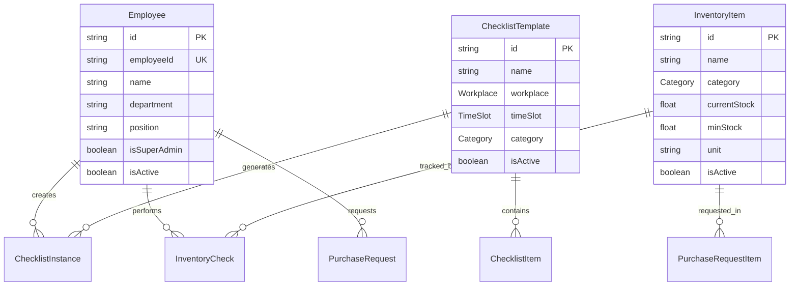

# 🍗 Kathario SaaS 프로젝트 참고 문서

> **바삭치킨 시스템을 기반으로 한 멀티테넌트 SaaS 전환 가이드**  
> 생성일: 2025년 1월 27일  
> 최종 업데이트: 2025년 9월 5일 - 프로젝트 현황 분석 및 상황 정리  
> 목적: 기존 바삭치킨 앱을 여러 레스토랑에게 제공하는 구독형 SaaS로 전환

## 🚀 **빠른 참조 (Quick Reference)**

### **📂 프로젝트 위치**
- **바삭치킨**: `/root/basak-chicken-app` (실제 운영 중 - 건드리지 말 것)
- **Kathario SaaS**: `/root/kathario-saas` (개발 중인 새 프로젝트)

### **🌐 접속 정보**
- **Kathario SaaS**: `http://91.99.75.135:3003` (외부) / `http://localhost:3003` (로컬)
- **테스트 계정**: `admin/demo123` 또는 `employee/demo123`

### **⚡ 현재 상태**
- **완성**: 랜딩페이지, 로그인/로그아웃, 대시보드 UI, 멀티테넌트 DB
- **미완성**: 회원가입 API (유일한 남은 작업)
- **Git**: Kathario SaaS는 origin보다 2 커밋 앞섰음 (push 필요)

---

## 📋 **목차**
1. [프로젝트 개요](#프로젝트-개요)
2. [현재 상황 및 문제점](#현재-상황-및-문제점)
3. [현재 바삭치킨 시스템 분석](#현재-바삭치킨-시스템-분석)
4. [데이터베이스 구조](#데이터베이스-구조)
5. [핵심 기능 분석](#핵심-기능-분석)
6. [멀티테넌트 전환 계획](#멀티테넌트-전환-계획)
7. [SaaS 구현 체크리스트](#saas-구현-체크리스트)

---

## 🎯 **프로젝트 개요**

### **비즈니스 목표**
- **기존**: 바삭치킨 단일 매장 운영 시스템
- **목표**: 여러 레스토랑에게 제공하는 구독형 SaaS
- **수익모델**: 월/연 구독료 (테넌트별 과금)
- **타겟**: 레스토랑 사장님들

### **개발 전략 및 배경**

**🚨 중요한 배경 설명:**
- **기존 바삭치킨 앱**: 단일 매장용으로 개발되어 실제 운영 중 (도메인, 구조 모두 SaaS 고려 없이 구축)
- **SaaS 전환 시도**: 기존 앱을 직접 SaaS로 전환하려다 오류 발생 → 백업본으로 복구
- **현재 전략**: 기존 바삭치킨은 그대로 운영하며, **완전히 새로운 SaaS 프로젝트**를 별도 구축
- **최종 목표**: SaaS 완성 후 → 바삭치킨 기능 이식 → 데이터 마이그레이션 → 바삭치킨도 SaaS의 첫 테넌트로 전환

**📋 개발 순서 및 진행상황:**
1. ✅ **상품소개 랜딩페이지** (완료 - 2025.09.05)
2. ✅ **새 SaaS 프로젝트 구축** (완료 - 2025.09.05: `/root/kathario-saas`)
   - Next.js 15 + TypeScript + Tailwind CSS
   - GitHub 저장소: `https://github.com/gotzkowsky2/kathario-saas.git`
   - 전문적인 SaaS 랜딩페이지 완성 (바삭치킨 성공사례 포함)
3. ✅ **인증 시스템 UI 구축** (완료 - 2025.09.05)
   - ✅ 로그인 페이지 (`/login`) - UI 완성, API 연동 대기
   - ✅ 회원가입 페이지 (`/signup`) - UI 완성, 백엔드 구현 필요
   - ✅ 대시보드 페이지 (`/dashboard`) - 기본 UI 완성
   - ✅ 로그아웃 기능 - 프론트엔드 구현 완료
4. ✅ **멀티테넌트 데이터베이스 설계** (완료 - 2025.09.05)
   - ✅ Prisma 스키마 완성 (PostgreSQL 기반)
   - ✅ 테넌트 모델 및 데이터 격리 구조 설계 완료
   - ✅ 바삭치킨 기반 모든 모델 멀티테넌트로 전환 완료
5. ✅ **인증 시스템 백엔드 구현** (거의 완료 - 2025.09.05)
   - ✅ 로그인 API (`/api/auth/login`) - 완전 구현됨
   - ❌ 회원가입 API (`/api/auth/signup`) - 구현 필요 (유일한 미완성)
   - ✅ 로그아웃 API (`/api/auth/logout`) - 완전 구현됨
   - ✅ 인증 라이브러리 (`/lib/auth/index.ts`) - 완전 구현됨
   - ✅ 테넌트 관리 (`/lib/tenant.ts`) - 완전 구현됨
   - ✅ 데이터베이스 연결 및 시드 데이터 - 완전 구현됨
6. 🔄 **바삭치킨 기능 분석 및 SaaS용 재구현** (대기 중)
7. 🔄 **바삭치킨 데이터 마이그레이션 및 테넌트 전환** (대기 중)

---

## 🚨 **현재 상황 및 문제점**

### **🎯 현재 상황 요약 (2025.09.05 확인)**
- **바삭치킨**: `/root/basak-chicken-app` - 실제 운영 중 (절대 건드리지 말 것)
- **Kathario SaaS**: `/root/kathario-saas` - 개발 중인 새로운 SaaS 프로젝트
- **대시보드 차이**: 의도된 설계 (단일 매장 vs SaaS용)
- **다음 작업**: 회원가입 API 구현 → 인증 시스템 완성

### **✅ 완성된 부분 (2025.09.05 기준)**
1. **랜딩페이지**: 완전히 작동하는 전문적인 SaaS 소개 페이지
   - 바삭치킨 성공사례 포함
   - 요금제, 기능 소개, CTA 완성
   - `localhost:3003`에서 정상 작동 확인 (포트 변경됨)

2. **인증 시스템 UI**: 모든 페이지 UI 완성
   - 로그인 페이지 (`/login`) - 데모 계정 정보 포함
   - 회원가입 페이지 (`/signup`) - 폼 검증 로직 완성
   - 대시보드 페이지 (`/dashboard`) - 현대적 SaaS 디자인 완성

3. **데이터베이스 설계**: 멀티테넌트 Prisma 스키마 완성
   - PostgreSQL 기반 완전한 멀티테넌트 구조
   - 바삭치킨의 모든 기능을 SaaS용으로 재설계
   - 테넌트별 데이터 격리 구조 완성

### **🔄 진행 중인 작업**
1. **인증 시스템 백엔드**: 거의 완료 (회원가입 API만 남음)
   - ✅ `/api/auth/login` - 완전 구현됨
   - ✅ `/api/auth/logout` - 완전 구현됨  
   - ❌ `/api/auth/signup` - 구현 필요 (유일한 미완성)

### **❌ 현재 문제점**
1. **외부 접속 주소 변경**: 현재 `http://91.99.75.135:3003`에서 실행 중
   - 포트 3000은 다른 프로세스가 사용 중이어서 3003으로 변경됨
   - 테넌트 도메인 미연결 상태 (개발환경에서는 localhost 사용)
   - 실제 도메인 연결 전까지는 IP:포트로 접속

2. **회원가입 API 미완성**: 유일한 미완성 기능
   - `/api/auth/signup` 구현 필요
   - 로그인/로그아웃은 완전히 작동

### **🎯 다음 우선순위**
1. **회원가입 API 구현** (최우선) - 인증 시스템 완성
2. **대시보드 메뉴/헤더 통일화** (신규 추가) - 바삭치킨과 동일한 구조로 변경
3. **애플리케이션 테스트** - 로그인 기능 검증
4. **도메인 연결 및 테넌트 설정** - 실제 서비스 준비
5. **바삭치킨 기능 이식 시작** - 체크리스트/재고 관리

---

## 🏗️ **현재 바삭치킨 시스템 분석**

### **📁 프로젝트 구조**
```
/root/basak-chicken-app/
├── src/
│   ├── app/
│   │   ├── admin/           # 관리자 페이지
│   │   ├── employee/        # 직원 페이지  
│   │   └── api/            # API 엔드포인트
│   ├── components/         # 재사용 컴포넌트
│   ├── lib/               # 유틸리티 (prisma, rateLimit 등)
│   └── types/             # TypeScript 타입 정의
├── prisma/                # 데이터베이스 스키마
└── public/               # 정적 파일
```

### **🔐 인증 시스템**
- **쿠키 기반 인증**: `__Host-employee_auth`, `__Host-admin_auth`
- **권한 구조**: 
  - 일반 직원 (`Employee.isSuperAdmin = false`)
  - 슈퍼관리자 (`Employee.isSuperAdmin = true`)
  - 별도 관리자 테이블 (`Admin`)
- **보안**: bcrypt 비밀번호 해싱, Rate Limiting

### **📊 실제 운영 데이터 (2025년 9월 기준)**
- **직원**: 6명 (슈퍼관리자 1명: 배재범)
- **재고 아이템**: 100+ 개 (치킨 재료, 포장재 등)
- **체크리스트 템플릿**: 13개 (홀/주방 업무)
- **활발한 운영**: 실제 데이터 지속 생성 중

---

## 🗄️ **데이터베이스 구조**

### **핵심 테이블 관계도**


### **🏢 운영 구조 Enum**
```typescript
enum Workplace {
  HALL      // 홀
  KITCHEN   // 주방  
  COMMON    // 공통
}

enum TimeSlot {
  PREPARATION  // 준비 (오픈 전)
  IN_PROGRESS  // 운영 중
  CLOSING      // 마감
  COMMON       // 공통
}

enum Category {
  CHECKLIST    // 체크리스트
  PRECAUTIONS  // 주의사항
  HYGIENE      // 위생
  SUPPLIES     // 용품
  INGREDIENTS  // 재료
  COMMON       // 공통
  MANUAL       // 매뉴얼
}
```

### **📦 실제 재고 데이터 예시**
| 품목명 | 카테고리 | 현재재고 | 최소재고 | 단위 |
|--------|----------|----------|----------|------|
| 무염지 윙 | INGREDIENTS | 0 | 5 | kg |
| 고추장(배달용) | INGREDIENTS | 23 | 10 | 개 |
| 배달봉투 | SUPPLIES | 0 | 1 | 박스 |
| 핑크 냅킨(매장) | SUPPLIES | 1 | 2 | 팩 |

---

## ⚙️ **핵심 기능 분석**

### **1️⃣ 체크리스트 시스템**
```typescript
// 템플릿 → 인스턴스 생성 흐름
ChecklistTemplate (설계도)
  ↓ 자동/수동 생성
ChecklistInstance (실제 작업)
  ↓ 직원이 수행
ChecklistItemProgress (항목별 완료 상태)
```

**핵심 특징:**
- **템플릿 기반**: 재사용 가능한 체크리스트 설계
- **자동 생성**: 요일별 반복 생성 (`recurrenceDays`)
- **진행 추적**: 항목별 완료 상태 및 메모
- **재오픈**: 관리자가 완료된 체크리스트 재오픈 가능

### **2️⃣ 재고 관리 시스템**
```typescript
// 재고 업데이트 흐름
InventoryItem (재고 아이템)
  ↓ 직원이 확인/업데이트
InventoryCheck (확인 기록)
  ↓ 부족시 자동 알림
PurchaseRequest (구매 요청)
```

**핵심 특징:**
- **실시간 추적**: 현재재고 vs 최소재고 비교
- **자동 알림**: 재고 부족시 `needsRestock` 플래그
- **구매 요청**: 직원이 구매 요청 → 관리자 승인
- **이력 관리**: 모든 재고 변경 기록 보존

### **3️⃣ 직원 권한 시스템**
```typescript
// 권한 구조
Employee.isSuperAdmin = true  → 모든 기능 접근
Employee.isSuperAdmin = false → 직원 기능만 접근
Admin 테이블                  → 별도 관리자 (미사용)
```

**핵심 특징:**
- **단순한 구조**: 슈퍼관리자 vs 일반직원
- **부서별 관리**: department, position 필드
- **임시 비밀번호**: `isTempPassword` 플래그

### **4️⃣ 태그 시스템**
```typescript
// 다대다 관계로 유연한 분류
Tag ←→ ChecklistTemplate
Tag ←→ InventoryItem  
Tag ←→ Manual
Tag ←→ Precaution
```

**핵심 특징:**
- **유연한 분류**: 색상별 태그로 시각적 구분
- **다중 태그**: 하나의 아이템에 여러 태그 가능
- **필터링**: 태그 기반 검색 및 필터링

---

## 🏢 **멀티테넌트 전환 계획**

### **🎯 테넌트 구조 설계**
```typescript
// 새로 추가할 테넌트 모델
model Tenant {
  id          String   @id @default(cuid())
  name        String   // "바삭치킨", "맛있는집" 등
  domain      String   @unique // "basak", "tasty" 등
  isActive    Boolean  @default(true)
  createdAt   DateTime @default(now())
  
  // 구독 정보
  subscriptionTier  SubscriptionTier
  subscriptionStart DateTime
  subscriptionEnd   DateTime?
  
  // 관계
  employees     Employee[]
  inventoryItems InventoryItem[]
  checklistTemplates ChecklistTemplate[]
  // ... 모든 주요 테이블에 tenantId 추가
}

enum SubscriptionTier {
  FREE      // 무료 (제한된 기능)
  PRO       // 프로 (월 구독)
  ENTERPRISE // 엔터프라이즈 (연 구독)
}
```

### **🔄 기존 테이블 수정 계획**
```sql
-- 모든 주요 테이블에 tenantId 추가
ALTER TABLE "Employee" ADD COLUMN "tenantId" TEXT;
ALTER TABLE "InventoryItem" ADD COLUMN "tenantId" TEXT;  
ALTER TABLE "ChecklistTemplate" ADD COLUMN "tenantId" TEXT;
-- ... 기타 테이블들

-- 외래키 제약조건 추가
ALTER TABLE "Employee" ADD CONSTRAINT "Employee_tenantId_fkey" 
  FOREIGN KEY ("tenantId") REFERENCES "Tenant"("id");
```

### **🛡️ 데이터 격리 전략**
```typescript
// 모든 쿼리에 tenantId 필터 자동 추가
const employees = await prisma.employee.findMany({
  where: { 
    tenantId: currentTenant.id,  // 필수!
    isActive: true 
  }
});

// Prisma Middleware로 자동화
prisma.$use(async (params, next) => {
  if (params.model && TENANT_MODELS.includes(params.model)) {
    if (params.action === 'findMany' || params.action === 'findFirst') {
      params.args.where = {
        ...params.args.where,
        tenantId: getCurrentTenantId()
      };
    }
  }
  return next(params);
});
```

### **🔐 인증 시스템 확장**
```typescript
// 기존 쿠키에 테넌트 정보 추가
interface AuthCookie {
  userId: string;
  tenantId: string;
  role: 'employee' | 'admin' | 'superadmin';
}

// 도메인 기반 테넌트 식별
function getTenantFromDomain(hostname: string): string {
  // basak.kathario.com → "basak"
  // tasty.kathario.com → "tasty"  
  return hostname.split('.')[0];
}
```

---

## ✅ **SaaS 구현 체크리스트**

### **🏗️ Phase 1: 기반 구조 (2-3주)**
- [ ] **테넌트 모델 설계 및 생성**
  - [ ] Tenant 테이블 생성
  - [ ] SubscriptionTier enum 정의
  - [ ] 기존 테이블에 tenantId 컬럼 추가
- [ ] **멀티테넌트 미들웨어 구현**
  - [ ] 도메인 기반 테넌트 식별
  - [ ] Prisma 미들웨어로 자동 필터링
  - [ ] 데이터 격리 검증
- [ ] **인증 시스템 확장**
  - [ ] 테넌트별 사용자 관리
  - [ ] 도메인 기반 로그인
  - [ ] 권한 시스템 확장

### **🎨 Phase 2: SaaS 전용 기능 (2-3주)**
- [ ] **테넌트 관리 대시보드**
  - [ ] 테넌트 생성/수정/삭제
  - [ ] 구독 상태 관리
  - [ ] 사용량 모니터링
- [ ] **구독 및 결제 시스템**
  - [ ] 구독 플랜 관리
  - [ ] 결제 연동 (Stripe/토스페이먼츠)
  - [ ] 자동 갱신 및 해지
- [ ] **온보딩 시스템**
  - [ ] 신규 테넌트 설정 마법사
  - [ ] 샘플 데이터 생성
  - [ ] 튜토리얼 가이드

### **📦 Phase 3: 기능 이식 (3-4주)**
- [ ] **체크리스트 시스템**
  - [ ] 템플릿 관리 (테넌트별)
  - [ ] 자동 생성 로직
  - [ ] 진행 상태 추적
- [ ] **재고 관리 시스템**  
  - [ ] 재고 아이템 관리
  - [ ] 자동 알림 시스템
  - [ ] 구매 요청 워크플로우
- [ ] **직원 관리 시스템**
  - [ ] 직원 등록/관리
  - [ ] 권한 설정
  - [ ] 근무 시간 관리
- [ ] **기타 기능들**
  - [ ] 매뉴얼 관리
  - [ ] 주의사항 관리
  - [ ] 태그 시스템
  - [ ] 공지사항

### **🔄 Phase 4: 마이그레이션 (1-2주)**
- [ ] **바삭치킨 데이터 마이그레이션**
  - [ ] 기존 데이터 백업
  - [ ] 테넌트 생성 ("basak-chicken")
  - [ ] 데이터 이전 스크립트 실행
  - [ ] 검증 및 테스트
- [ ] **도메인 설정**
  - [ ] basak.kathario.com 설정
  - [ ] SSL 인증서 적용
  - [ ] DNS 레코드 업데이트

### **🚀 Phase 5: 런칭 준비 (1-2주)**
- [ ] **성능 최적화**
  - [ ] 데이터베이스 인덱스 최적화
  - [ ] 쿼리 성능 튜닝
  - [ ] 캐싱 전략 구현
- [ ] **보안 강화**
  - [ ] 데이터 격리 재검증
  - [ ] 보안 테스트
  - [ ] 백업 전략 수립
- [ ] **모니터링 및 로깅**
  - [ ] 에러 추적 시스템
  - [ ] 사용량 모니터링
  - [ ] 성능 메트릭 수집

---

## 🎯 **성공 지표**

### **기술적 지표**
- **데이터 격리**: 100% (테넌트간 데이터 유출 0건)
- **응답 시간**: 평균 < 200ms
- **가용성**: 99.9% 업타임
- **동시 테넌트**: 최소 10개 테넌트 지원

### **비즈니스 지표**  
- **첫 고객**: 바삭치킨 성공적 마이그레이션
- **신규 가입**: 월 2-3개 레스토랑 목표
- **고객 만족도**: NPS 70+ 달성
- **수익성**: 6개월 내 손익분기점

---

## 📞 **연락처 및 참고사항**

### **개발 환경**
- **바삭치킨 프로젝트**: `/root/basak-chicken-app` (기존 운영 중인 프로젝트 - 그대로 유지)
- **카타리오 SaaS 프로젝트**: `/root/kathario-saas` (완전히 새로운 멀티테넌트 SaaS 프로젝트)
- **데이터베이스**: PostgreSQL (localhost:5432)
- **프레임워크**: Next.js 15 + Prisma + TypeScript
- **인증**: Cookie-based (bcrypt + httpOnly)

### **⚠️ 중요: 프로젝트 구분 및 개발 전략**

**🔄 왜 이렇게 분리해서 개발하는가?**
1. **기존 바삭치킨**: 단일 매장용으로 설계되어 SaaS 구조 고려 없음
2. **직접 전환 시도**: 기존 앱을 SaaS로 바꾸려다 오류 발생 → 백업 복구
3. **현재 전략**: 안전하게 별도 SaaS 프로젝트 구축 → 완성 후 기능 이식

**📂 프로젝트 구분:**
1. **바삭치킨 (`/root/basak-chicken-app`)**
   - 기존 단일 매장 운영 시스템 (실제 운영 중)
   - 직원 6명, 재고 100+ 개 활발히 사용 중
   - **절대 건드리지 말고 그대로 유지**
   - SaaS 개발 시 **참고용으로만 사용**
   - GitHub: `https://github.com/gotzkowsky2/basak-chicken.git`

2. **카타리오 SaaS (`/root/kathario-saas`)**
   - **완전히 새로운** 멀티테넌트 SaaS 프로젝트
   - 바삭치킨 구조를 분석하여 SaaS용으로 재설계
   - 여러 레스토랑에게 제공하는 구독형 서비스
   - **처음부터 SaaS 구조로 새로 개발**
   - GitHub: `https://github.com/gotzkowsky2/kathario-saas.git`

**🎯 최종 목표:**
SaaS 완성 → 바삭치킨 기능 이식 → 데이터 마이그레이션 → 바삭치킨을 SaaS의 첫 번째 테넌트로 전환

### **중요 참고사항**
1. **기존 바삭치킨 운영 중단 없이** 개발 진행
2. **데이터 무결성** 최우선 (백업 필수)
3. **점진적 마이그레이션** (단계별 검증)
4. **사용자 경험 유지** (기존 워크플로우 보존)

---

## 📊 **최신 개발 현황** (2025.09.05 업데이트)

### **🔍 프로젝트 현황 분석 (2025.09.05 확인)**

**📂 프로젝트 구조 현황:**
1. **바삭치킨** (`/root/basak-chicken-app`)
   - 브랜치: `feature/admin-messaging`
   - 상태: **실제 운영 중** (직원 6명, 재고 100+ 개)
   - 최근 커밋: 2025년 8월까지 활발한 개발
   - 대시보드: 실용적인 8개 기능 카드 (단순 그리드)
   - **절대 건드리지 말고 그대로 유지**

2. **Kathario SaaS** (`/root/kathario-saas`)
   - 브랜치: `main` (origin보다 2 커밋 앞섬)
   - 상태: **개발/베타 단계** (완전히 새로운 프로젝트)
   - 최근 커밋: 2025년 9월 5일까지 활발한 개발
   - 대시보드: 현대적 디자인 (통계 카드, 활동 피드, 글래스모피즘)

**🎨 대시보드 비교 결과:**
- **바삭치킨**: `AdminDashboardClient.tsx` - 실용적, 단순한 관리자 대시보드
- **Kathario SaaS**: `dashboard/page.tsx` - 현대적, 세련된 SaaS 대시보드
- **완전히 다른 디자인**: 의도된 설계 (단일 매장 vs SaaS)

**🔍 메뉴/헤더 구조 분석 결과:**
- **바삭치킨 헤더** (`/admin/layout.tsx`):
  - 홈 아이콘 + 드롭다운 메뉴 (8개 항목)
  - 사용자 정보 (이름, 부서, 직책) + 👑 아이콘
  - 직원 페이지 이동 + 로그아웃 버튼
  - 단순하고 실용적인 디자인

- **Kathario SaaS 헤더** (`/dashboard/layout.tsx`):
  - Kathario 로고 + 드롭다운 메뉴 (8개 항목)
  - 사용자 정보 (이름, 테넌트, 역할) + 아바타
  - 직원 페이지 이동 + 설정 + 로그아웃 버튼
  - 현대적이고 세련된 디자인 (글래스모피즘, 그라데이션)

**⚠️ 메뉴 구조 차이점:**
- 바삭치킨: 개발용 체크리스트 생성기 포함
- Kathario SaaS: 설정 메뉴 추가, 더 세련된 UI

### **✅ 완성된 구현 사항**
1. **멀티테넌트 데이터베이스**: PostgreSQL 기반 완전한 SaaS 구조
2. **인증 시스템 백엔드**: 로그인/로그아웃 API 완전 구현
3. **테넌트 관리 시스템**: 도메인 기반 멀티테넌시 구현
4. **시드 데이터**: 테스트 계정 및 샘플 데이터 생성 완료
5. **현대적 SaaS 대시보드**: 통계, 빠른 작업, 최근 활동 피드 완성

### **🔐 현재 테스트 계정**
- **관리자**: `admin / demo123`
- **직원**: `employee / demo123`  
- **테넌트**: demo (개발환경용)

### **🌐 현재 접속 정보**
- **로컬**: `http://localhost:3003`
- **외부**: `http://91.99.75.135:3003`
- **GitHub**: `https://github.com/gotzkowsky2/kathario-saas.git`
- **데이터베이스**: PostgreSQL (localhost:5432/kathario_saas)

### **⚠️ 중요 참고사항**
1. **포트 변경**: 3000번 포트가 사용 중이어서 3003번으로 자동 변경
2. **테넌트 도메인**: 아직 실제 도메인 미연결 (개발환경에서는 localhost 사용)
3. **외부 접속**: IP 주소로 직접 접속 가능 (`91.99.75.135:3003`)
4. **미완성**: 회원가입 API만 구현하면 인증 시스템 완전 완성
5. **Git 상태**: Kathario SaaS는 origin보다 2 커밋 앞서 있음 (push 필요)

### **📋 다음 작업: 메뉴/헤더 통일화 계획**

**🎯 목표**: Kathario SaaS의 대시보드 헤더를 바삭치킨과 동일한 구조로 변경

**🔧 구체적 작업 내용:**
1. **헤더 디자인 변경** (`/root/kathario-saas/src/app/dashboard/layout.tsx`)
   - 현재: 현대적 글래스모피즘 디자인
   - 변경: 바삭치킨과 동일한 단순하고 실용적인 디자인
   - 배경: `bg-white border-b border-gray-200 shadow-sm`

2. **로고 부분 수정**
   - 현재: Kathario 로고 + 그라데이션 아이콘
   - 변경: 홈 아이콘만 (바삭치킨과 동일)

3. **사용자 정보 영역 변경**
   - 현재: 아바타 + 테넌트 정보
   - 변경: 👑 아이콘 + 관리자 표시 (바삭치킨 스타일)

4. **메뉴 항목 정렬**
   - 바삭치킨 순서에 맞춰 메뉴 항목 재정렬
   - 개발용 체크리스트 생성기는 제외 (SaaS에서는 불필요)
   - 설정 메뉴는 유지 (SaaS 특성상 필요)

5. **스타일 통일화**
   - 버튼, 드롭다운, hover 효과 모두 바삭치킨과 동일하게
   - 색상 스키마: blue, green, red, orange, indigo, teal, purple, yellow

**📁 수정할 파일:**
- `/root/kathario-saas/src/app/dashboard/layout.tsx` (메인 헤더 레이아웃)

**✅ 완료 기준:**
- 바삭치킨과 시각적으로 거의 동일한 헤더
- 기능적으로 동일한 메뉴 구조
- SaaS 특성 (테넌트 정보, 설정)은 유지하되 디자인은 통일

---

*이 문서는 Kathario SaaS 프로젝트의 마스터 참고 문서입니다. 개발 진행에 따라 지속적으로 업데이트됩니다.*
